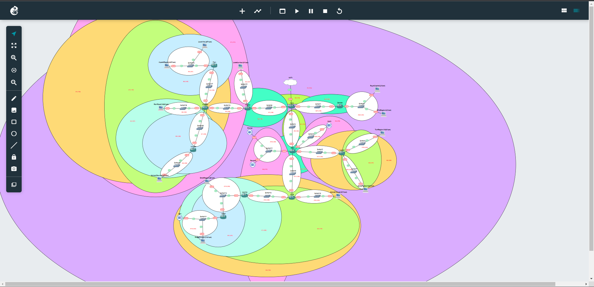
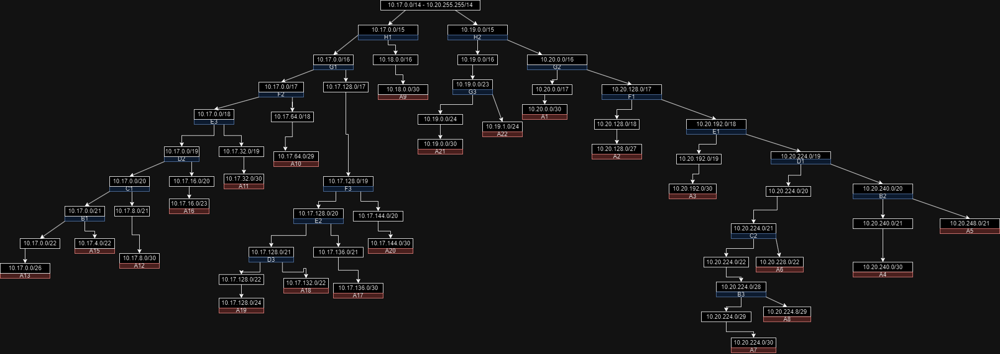

# Jarkom-Modul-4-B17-2023

## Anggota Kelompok
| Nama                       | NRP        |
| -------------------------- | ---------- |
| Abdullah Nasih Jasir       | 5025211111 |
| Yohanes Teguh Ukur Ginting | 5025211179 |

## Rute
| Subnet | Rute                                     | Jumlah IP | Netmask |
|--------|------------------------------------------|-----------|---------|
| A1     | Aura - Frieren                           | 2         | /30     |
| A2     | Frieren - Switch3 - LakeKorridor         | 25        | /27     |
| A3     | Frieren - Flamme                         | 2         | /30     |
| A4     | Flamme - Fern                            | 2         | /30     |
| A5     | Fern - Switch4 - LaubHills - AppetitRegion| 1023     | /21     |
| A6     | Flamme - Switch5 - RohrRoad              | 1001      | /22     |
| A7     | Flamme - Himmel                          | 2         | /30     |
| A8     | Himmel - Switch6 - SchwerMountains       | 6         | /29     |
| A9     | Aura - Eisen                             | 2         | /30     |
| A10    | Eisen - Switch1 - Richter - Revolte      | 3         | /29     |
| A11    | Eisen - Linie                            | 2         | /30     |
| A12    | Linie - Lawine                           | 2         | /30     |
| A13    | Lawine - Switch7 - BredtRegion - Heiter  | 31        | /26     |
| A15    | Heiter - Switch8 - RiegelCanyon - Sein   | 512       | /22     |
| A16    | Linie - Switch11 - GranzChannel          | 255       | /23     |
| A17    | Eisen - Lugner                           | 2         | /30     |
| A18    | Lugner - Switch10 - TurkRegion           | 1001      | /22     |
| A19    | Lugner - Switch9 - GlobeForest           | 251       | /24     |
| A20    | Eisen - Switch0 - Stark                  | 2         | /30     |
| A21    | Aura - Denken                            | 2         | /30     |
| A22    | Denken - Switch2 - RoyalCapital - WileRegion | 127   | /24     |
| Total  |                                          | 4255      | /19     |

---

## VLSM - CPT
### Pembagiaan Subnet


### Tree VLSM


### Pembagian NID, Netmask, dan Broadcast tiap Subnet
| Subnet | Network ID    | Netmask            | Broadcast      | Jumlah IP | Netmask |
|--------|---------------|--------------------|----------------|-----------|---------|
| A1     | 10.17.24.112  | 255.255.255.252    | 10.17.24.115   | 2         | /30     |
| A2     | 10.17.24.64   | 255.255.255.224    | 10.17.24.95    | 25        | /27     |
| A3     | 10.17.24.116  | 255.255.255.252    | 10.17.24.119   | 2         | /30     |
| A4     | 10.17.24.120  | 255.255.255.252    | 10.17.24.123   | 2         | /30     |
| A5     | 10.17.0.0     | 255.255.248.0      | 10.17.7.255    | 1023      | /21     |
| A6     | 10.17.8.0     | 255.255.252.0      | 10.17.11.255   | 1001      | /22     |
| A7     | 10.17.24.124  | 255.255.255.252    | 10.17.24.127   | 2         | /30     |
| A8     | 10.17.24.96   | 255.255.255.248    | 10.17.24.103   | 6         | /29     |
| A9     | 10.17.24.128  | 255.255.255.252    | 10.17.24.131   | 2         | /30     |
| A10    | 10.17.24.104  | 255.255.255.248    | 10.17.24.111   | 3         | /29     |
| A11    | 10.17.24.132  | 255.255.255.252    | 10.17.24.135   | 2         | /30     |
| A12    | 10.17.24.136  | 255.255.255.252    | 10.17.24.139   | 2         | /30     |
| A13    | 10.17.24.0    | 255.255.255.192    | 10.17.24.63    | 31        | /26     |
| A15    | 10.17.16.0    | 255.255.252.0      | 10.17.19.255   | 512       | /22     |
| A16    | 10.17.20.0    | 255.255.254.0      | 10.17.21.255   | 255       | /23     |
| A17    | 10.17.24.140  | 255.255.255.252    | 10.17.24.143   | 2         | /30     |
| A18    | 10.17.12.0    | 255.255.252.0      | 10.17.15.255   | 1001      | /22     |
| A19    | 10.17.22.0    | 255.255.255.0      | 10.17.22.255   | 251       | /24     |
| A20    | 10.17.24.144  | 255.255.255.252    | 10.17.24.147   | 2         | /30     |
| A21    | 10.17.24.148  | 255.255.255.252    | 10.17.24.151   | 2         | /30     |
| A22    | 10.17.23.0    | 255.255.255.0      | 10.17.23.255   | 127       | /24     |

### Hasil Pembagian IP tiap Node
IP ini yang akan digunakan untuk subnetting
| Subnet | Node           | IP            |
|--------|----------------|---------------|
| A1     | Aura           | 10.17.24.113  |
| A1     | Frieren        | 10.17.24.114  |
| A2     | Frieren        | 10.17.24.65   |
| A2     | LakeKoridor    | 10.17.24.66   |
| A3     | Frieren        | 10.17.24.117  |
| A3     | Flamme         | 10.17.24.118  |
| A4     | Flamme         | 10.17.24.121  |
| A4     | Fern           | 10.17.24.122  |
| A5     | Fern           | 10.17.0.1     |
| A5     | AppetitRegion  | 10.17.0.2     |
| A5     | LaubHills      | 10.17.2.115   |
| A6     | Flamme         | 10.17.8.1     |
| A6     | RohrRoad       | 10.17.8.2     |
| A7     | Flamme         | 10.17.24.125  |
| A7     | Himmel         | 10.17.24.126  |
| A8     | Himmel         | 10.17.24.97   |
| A8     | SchwerMountains| 10.17.24.98   |
| A9     | Aura           | 10.17.24.129  |
| A9     | Eisen          | 10.17.24.130  |
| A10    | Eisen          | 10.17.24.105  |
| A10    | Richter        | 10.17.24.106  |
| A10    | Revolte        | 10.17.24.107  |
| A11    | Eisen          | 10.17.24.133  |
| A11    | Linie          | 10.17.24.134  |
| A12    | Linie          | 10.17.24.137  |
| A12    | Lawine         | 10.17.24.138  |
| A13    | Lawine         | 10.17.24.1    |
| A13    | Heiter         | 10.17.24.2    |
| A13    | BredtRegion    | 10.17.24.3    |
| A15    | Haiter         | 10.17.16.1    |
| A15    | RiegelCanyon   | 10.17.16.2    |
| A15    | Sein           | 10.17.18.0    |
| A16    | Linie          | 10.17.20.1    |
| A16    | GranzChannel   | 10.17.20.2    |
| A17    | Eisen          | 10.17.24.141  |
| A17    | Lugner         | 10.17.24.142  |
| A18    | Lugner         | 10.17.12.1    |
| A18    | TurkRegion     | 10.17.12.2    |
| A19    | Lugner         | 10.17.22.1    |
| A19    | GrobeForest    | 10.17.22.2    |
| A20    | Eisen          | 10.17.24.145  |
| A20    | Stark          | 10.17.24.146  |
| A21    | Aura           | 10.17.24.149  |
| A21    | Denken         | 10.17.24.150  |
| A22    | Denken         | 10.17.23.1    |
| A22    | RoyalCapital   | 10.17.23.2    |
| A22    | WilleRegion    | 10.17.23.65   |

### Routing
Routing dilakukan pada Router (terdapat 11 router)

Aura<br>


Denken<br>


Frieren<br>


Flamme<br>


Fern<br>


Himmel<br>


Eisen<br>


Lugner<br>


Linie<br>


Lawine<br>


Heiter<br>


Testing<br>
Mengirim pesan antar client beda subnet/sama subnet<br>


https://github.com/njabdullah/Jarkom-Modul-4-B17-2023/assets/92930757/c8b5b56f-0cba-49ce-95cd-dba20d50d096

---

## CIDR - GNS3

### Pembagiaan Subnet


### Tree VLSM


### Penggabungan Subnet

### I

| Subnet | Gabungan dari | Gabungan dengan | Netmask Akhir |
|--------|---------------|---------------|---------------|
| B1     | A13 /26       | A15 /22       | /21           |
| B2     | A5 /21        | A4 /30        | /20           |
| B3     | A7 /30        | A8 /29        | /28           |

### II

| Subnet | Gabungan dari | Gabungan dengan | Netmask Akhir |
|--------|---------------|---------------|---------------|
| C1     | B1 /21        | A12 /30       | /20           |
| C2     | B3 /28        | A6 /22        | /21           |

### III

| Subnet | Gabungan dari | Gabungan dengan | Netmask Akhir |
|--------|---------------|---------------|---------------|
| D1     | B2 /20        | C2 /21        | /19           |
| D2     | C1 /20        | A16 /23       | /19           |
| D3     | A18 /22       | A19 /24       | /21           |

### IV

| Subnet | Gabungan dari | Gabungan dengan | Netmask Akhir |
|--------|---------------|---------------|---------------|
| E1     | D1 /19        | A3 /30        | /18           |
| E2     | D3 /21        | A17 /30       | /20           |
| E3     | D2 /19        | A11 /30       | /18           |

### V

| Subnet | Gabungan dari | Gabungan dengan | Netmask Akhir |
|--------|---------------|---------------|---------------|
| F1     | E1 /18        | A2 /27        | /17           |
| F2     | E3 /18        | A10 /29       | /17           |
| F3     | E2 /20        | A20 /30       | /19           |

### VI

| Subnet | Gabungan dari | Gabungan dengan | Netmask Akhir |
|--------|---------------|---------------|---------------|
| G1     | F2 /17        | F3 /19        | /16           |
| G2     | F1 /17        | A1 /30        | /16           |
| G3     | A21 /30       | A22 /24       | /23           |

### VII

| Subnet | Gabungan dari | Gabungan dengan | Netmask Akhir |
|--------|---------------|---------------|---------------|
| H1     | G1 /16        | A9 /30        | /15           |
| H2     | G2 /16        | G3 /23        | /15           |

### VIII

| Subnet | Gabungan dari | Gabungan dengan | Netmask Akhir |
|--------|---------------|---------------|---------------|
| I1     | H2 /15        | H1 /16        | /14           |


### Pembagian NID, Netmask, dan Broadcast tiap Subnet
| Subnet | Network ID      | Netmask          | Broadcast     |
|--------|-----------------|------------------|---------------|
| A1     | 10.20.0.0 / 30  | 255.255.255.252  | 10.20.0.3     |
| A2     | 10.20.128.0 / 27| 255.255.255.224  | 10.20.128.31  |
| A3     | 10.20.192.0 / 30| 255.255.255.252  | 10.20.192.3   |
| A4     | 10.20.240.0 / 30| 255.255.255.252  | 10.20.240.3   |
| A5     | 10.20.248.0 / 21| 255.255.248.0    | 10.20.255.255 |
| A6     | 10.20.228.0 / 22| 255.255.252.0    | 10.20.231.255 |
| A7     | 10.20.224.0 / 30| 255.255.255.252  | 10.20.224.3   |
| A8     | 10.20.224.8 / 29| 255.255.255.248  | 10.20.224.15  |
| A9     | 10.18.0.0 / 30  | 255.255.255.252  | 10.18.0.3     |
| A10    | 10.17.64.0 / 29 | 255.255.255.248  | 10.17.64.7    |
| A11    | 10.17.32.0 / 30 | 255.255.255.252  | 10.17.32.3    |
| A12    | 10.17.8.0 / 30  | 255.255.255.252  | 10.17.8.3     |
| A13    | 10.17.0.0 / 26  | 255.255.255.192  | 10.17.0.63    |
| A14    |                 |                  |               |
| A15    | 10.17.4.0 / 22  | 255.255.252.0    | 10.17.7.255   |
| A16    | 10.17.16.0 / 23 | 255.255.254.0    | 10.17.17.255  |
| A17    | 10.17.136.0 / 30| 255.255.255.252  | 10.17.136.3   |
| A18    | 10.17.132.0 / 22| 255.255.252.0    | 10.17.135.255 |
| A19    | 10.17.128.0 / 24| 255.255.255.0    | 10.17.128.255 |
| A20    | 10.17.144.0 / 30| 255.255.255.252  | 10.17.144.3   |
| A21    | 10.19.0.0 / 30  | 255.255.255.252  | 10.19.0.3     |
| A22    | 10.19.1.0 / 24  | 255.255.255.0    | 10.19.1.255   |

### Hasil Pembagian IP tiap Node
IP ini yang akan digunakan untuk subnetting

| Subnet | Nama Node             | ETH  | IP            | Netmask         | Gateway      |
|--------|-----------------------|------|---------------|-----------------|--------------|
| A1     | Aura                  | eth3 | 10.20.0.1     | 255.255.255.252 |              |
|        | Frieren               | eth0 | 10.20.0.2     |                 | 10.20.0.1    |
| A2     | Frieren               | eth1 | 10.20.128.1   | 255.255.255.224 |              |
|        | LakeKorridor (24 Host)| eth0 | 10.20.128.2   |                 | 10.20.128.1  |
| A3     | Frieren               | eth2 | 10.20.192.1   | 255.255.255.252 |              |
|        | Flamme                | eth0 | 10.20.192.2   |                 | 10.20.192.1  |
| A4     | Flamme                | eth1 | 10.20.240.1   | 255.255.255.252 |              |
|        | Fern                  | eth0 | 10.20.240.2   |                 | 10.20.240.1  |
| A5     | Fern                  | eth1 | 10.20.248.1   | 255.255.248.0   |              |
|        | LaubHills (397 Host)  | eth0 | 10.20.248.2   |                 | 10.20.248.1  |
|        | AppetitRegion (625 Host)|eth0| 10.20.248.3   |                 | 10.20.248.1  |
| A6     | Flamme                | eth2 | 10.20.228.1   | 255.255.252.0   |              |
|        | RohrRoad (1000 Host)  | eth0 | 10.20.228.2   |                 | 10.20.228.1  |
| A7     | Flamme                | eth3 | 10.20.224.1   | 255.255.255.252 |              |
|        | Himmel                | eth0 | 10.20.224.2   |                 | 10.20.244.1  |
| A8     | Himmel                | eth1 | 10.20.224.9   | 255.255.255.248 |              |
|        | SchwerMountains (5 Host)|eth0| 10.20.224.10  |                 | 10.20.224.9  |
| A9     | Aura                  | eth2 | 10.18.0.1     | 255.255.255.252 |              |
|        | Eisen                 | eth0 | 10.18.0.2     |                 | 10.18.0.1    |
| A10    | Eisen                 | eth4 | 10.17.64.1    | 255.255.255.248 |              |
|        | Richter               | eth0 | 10.17.64.2    |                 | 10.17.64.1   |
|        | Revolte               | eth0 | 10.17.64.3    |                 | 10.17.64.1   |
| A11    | Linie                 | eth0 | 10.17.32.2    | 255.255.255.252 | 10.17.32.1   |
|        | Eisen                 | eth3 | 10.17.32.1    |                 |              |
| A12    | Linie                 | eth2 | 10.17.8.1     | 255.255.255.252 |              |
|        | Lawine                | eth0 | 10.17.8.2     |                 | 10.17.8.1    |
| A13    | Lawine                | eth1 | 10.17.0.1     | 255.255.255.192 |              |
|        | Heiter                | eth0 | 10.17.0.2     |                 | 10.17.0.1    |
|        | BredtRegion (29 Host) | eth0 | 10.17.0.3     |                 | 10.17.0.1    |
| A15    | Heiter                | eth1 | 10.17.4.1     | 255.255.252.0   |              |
|        | Sein                  | eth0 | 10.17.4.2     |                 | 10.17.4.1    |
|        | ReigelCanyon (510 Host)|eth0| 10.17.4.3     |                 | 10.17.4.1    |
| A16    | Linie                 | eth1 | 10.17.16.1    | 255.255.254.0   |              |
|        | GranzChannel (254 Host)|eth0| 10.17.16.2    |                 | 10.17.16.1   |
| A17    | Lugner                | eth0 | 10.17.136.2   | 255.255.255.252 | 10.17.136.1  |
|        | Eisen                 | eth2 | 10.17.136.1   |                 |              |
| A18    | Lugner                | eth1 | 10.17.132.1   | 255.255.252.0   |              |
|        | TurkRegion (1000 Host)| eth0| 10.17.132.2   |                 | 10.17.132.1  |
| A19    | Lugner                | eth2 | 10.17.128.1   | 255.255.255.0   |              |
|        | GrobeForest (1000 Host)|eth0| 10.17.128.2   |                 | 10.17.128.1  |
| A20    | Stark                 | eth0 | 10.17.144.2   | 255.255.255.252 | 10.17.144.1  |
|        | Eisen                 | eth1 | 10.17.144.1   |                 |              |
| A21    | Denken                | eth0 | 10.19.0.2     | 255.255.255.252 | 10.19.0.1    |
|        | Aura                  | eth1 | 10.19.0.1     |                 |              |
|A22     | RoyalCapital (63 Host)|eth0  | 10.19.1.2     | 255.255.255.0   | 10.19.1.1    |
|        | WilleRegion (63 Host) |eth0  | 10.19.1.65    |                 | 10.19.1.1    |
|        |Denken                 |eth1  | 10.19.1.1     |                 |              |

### Routing

```bash
--------------------- Routing ------------------------------

-------- A5 - Fern ------------

A5 > A6 = Fern - Flamme = route add -net 10.20.228.0 netmask 255.255.252.0 gw 10.20.240.1 >> Fern - Flamme ❤️
A5 > A8 = Fern - Flamme - Himmel = 
				route add -net 10.20.224.8 netmask 255.255.255.248 gw 10.20.240.1 >> Fern - Flamme❤️
				route add -net 10.20.224.8 netmask 255.255.255.248 gw 10.20.224.2 >> Flamme - Himmel
A5 > A2 = Fern - Flamme - Frieren = 
				route add -net 10.20.128.0 netmask 255.255.255.224 gw 10.20.240.1 >> Fern - Flamme❤️
				route add -net 10.20.128.0 netmask 255.255.255.224 gw 10.20.192.1 >> Flamme - Frieren
A5 > A22 = Fern - Flamme - Frieren - Aura - Denken = 
				route add -net 10.19.1.0 netmask 255.255.255.0 gw 10.20.240.1 >> Fern - Flamme❤️
				route add -net 10.19.1.0 netmask 255.255.255.0 gw 10.20.192.1 >> Flamme - Frieren
				route add -net 10.19.1.0 netmask 255.255.255.0 gw 10.20.0.1 >> Frieren - Aura
				route add -net 10.19.1.0 netmask 255.255.255.0 gw 10.19.0.2 >> Aura - Denken
A5 > A20 = Fern - Flamme - Frieren - Aura - Eisen =
				route add -net 10.17.144.0 netmask 255.255.255.252 gw 10.20.240.1 >> Fern - Flamme💛
				route add -net 10.17.144.0 netmask 255.255.255.252 gw 10.20.192.1 >> Flamme - Frieren
				route add -net 10.17.144.0 netmask 255.255.255.252 gw 10.20.0.1 >> Frieren - Aura
				
-------- A6 - Flamme ----------

A6 > A5 = Flamme - Fern = route add -net 10.20.248.0 netmask 255.255.248.0 gw 10.20.240.2 >> Flamme - Fern 💛
A6 > A2 = Flamme - Frieren = route add -net 10.20.128.0 netmask 255.255.255.224 gw 10.20.192.1 >> Flamme - Frieren❤️
A6 > A8 = Flamme - Himmel = route add -net 10.20.224.8 netmask 255.255.255.248 gw 10.20.224.2 >> Flamme - Himmel💛
A6 > A22 = Flamme - Frieren - Aura - Denken = (sudah dari A5 > A22) ❤️
				

-------- A2 - Frieren ----------

A2 > A5 = Frieren - Flamme - Fern = 
				route add -net 10.20.248.0 netmask 255.255.248.0 gw 10.20.192.2 >> Frieren - Flamme💛
                                route add -net 10.20.248.0 netmask 255.255.248.0 gw 10.20.240.2 >> Flamme - Fern
A2 > A6 = Frieren - Flamme = route add -net 10.20.228.0 netmask 255.255.252.0 gw 10.20.192.2 >> Frieren - Flamme💛
A2 > A8 = Frieren - Flamme - Himmel = 
				route add -net 10.20.224.8 netmask 255.255.255.248 gw 10.20.192.2 >> Frieren - Flamme💛
				route add -net 10.20.224.8 netmask 255.255.255.248 gw 10.20.224.2 >> Flamme - Himmel
A2 > A22 = Fieren - Aura - Denken = (sama dari A5 > A22)❤️

-------- A8 - Himmel ----------

A8 > A5 = Himmel - Flamme - Fern = 
				route add -net 10.20.248.0 netmask 255.255.248.0 gw 10.20.224.1 >> Himmel - Flamme💛
                                route add -net 10.20.248.0 netmask 255.255.248.0 gw 10.20.240.2 >> Flamme - Fern
A8 > A2 = Himmel - Flamme - Frieren = 
				route add -net 10.20.128.0 netmask 255.255.255.224 gw 10.20.224.1 >> Himmel - Flamme❤️
                                route add -net 10.20.128.0 netmask 255.255.255.224 gw 10.20.192.1 >> Flamme - Frieren
A8 > A6 = Himmel - Flamme = route add -net 10.20.228.0 netmask 255.255.252.0 gw 10.20.224.1 >> Himmel - Flamme❤️
A8 > A22 = Himmel - Flamme - Frieren - Aura - Denken =
				route add -net 10.19.1.0 netmask 255.255.255.0 gw 10.20.224.1 >> Himmel - Flamme❤️
				
-------- A10 - Eisen -----------

A10 > A22 = Eisen - Aura - Denken = (sama dari A20 > A22)❤️

-------- A16 - Linie -----------

A16 > A20 = Linie - Eisen = route add -net 10.17.144.0 netmask 255.255.255.252 gw 10.17.32.1 >> Linie - Eisen 💛

-------- A18 - Lugner -----------

A18 > A22 = Lugner - Eisen - Aura - Denken = 
				route add -net 10.19.1.0 netmask 255.255.255.0 gw 10.17.136.1 >> Lugner - Eisen ❤️

-------- A19 - Lugner -----------

A19 > A22 = Lugner - Eisen - Aura - Denken = (sama dari A18 > A22)
				route add -net 10.19.1.0 netmask 255.255.255.0 gw 10.17.136.1 >> Lugner - Eisen ❤️

-------- A20 - Eisen -----------
A20 > A22 = Eisen - Aura - Denken = 
				route add -net 10.19.1.0 netmask 255.255.255.0 gw 10.18.0.1 >> Eisen - Aura ❤️
A20 > A5 = Eisen - Aura - Frieren - Flamme - Fern = 
				route add -net 10.20.248.0 netmask 255.255.248.0 gw 10.18.0.1 >> Eisen - Aura❤️
A20 > A16 = Eisen - Linie = 
				route add -net 10.17.16.0 netmask 255.255.254.0 gw 10.17.32.2 >> Eisen - Linie ❤️
-------- A22 - Denken ----------
A22 > A5 = Denken - Aura - Frieren - Flamme - Fern =
				route add -net 10.20.248.0 netmask 255.255.248.0 gw 10.19.0.1 >> Denken - Aura💛
				route add -net 10.20.248.0 netmask 255.255.248.0 gw 10.20.0.2 >> Aura - Frieren
				route add -net 10.20.248.0 netmask 255.255.248.0 gw 10.20.192.2 >> Frieren - Flamme
		 🥴		route add -net 10.20.248.0 netmask 255.255.248.0 gw 10.20.240.2 >> Flamme - Fern

A22 > A6 = Denken - Aura - Frieren - Flamme = 
				route add -net 10.20.228.0 netmask 255.255.252.0 gw 10.19.0.1 >> Denken - Aura💛
				route add -net 10.20.228.0 netmask 255.255.252.0 gw 10.20.0.2 >> Aura - Frieren
A22 > A8 = Denken - Aura - Frieren - Flamme - Himmel = 
				route add -net 10.20.224.8 netmask 255.255.255.248 gw 10.19.0.1 >> Denken - Aura💛
				route add -net 10.20.224.8 netmask 255.255.255.248 gw 10.20.0.2 >> Aura - Frieren
A22 > A2 = Denken - Aura - Frieren = 
				route add -net 10.20.128.0 netmask 255.255.255.224 gw 10.19.0.1 >> Denken - Aura💛
				route add -net 10.20.128.0 netmask 255.255.255.224 gw 10.20.0.2 >> Aura - Frieren
A22 > A20 = Denken - Aura - Eisen = 
				route add -net 10.17.144.0 netmask 255.255.255.252 gw 10.19.0.1 >> Denken - Aura💛
				route add -net 10.17.144.0 netmask 255.255.255.252 gw 10.18.0.2 >> Aura - Eisen
A22 > A10 = Denken - Aura - Eisen = 
				route add -net 10.17.64.0 netmask 255.255.255.248 gw 10.19.0.1 >> Denken - Aura💛
				route add -net 10.17.64.0 netmask 255.255.255.248 gw 10.18.0.2 >> Aura - Eisen
A22 > A18 = Denken - Aura - Eisen - Lugner =
				route add -net 10.17.132.0 netmask 255.255.252.0 gw 10.19.0.1 >> Denken - Aura💛
				route add -net 10.17.132.0 netmask 255.255.252.0 gw 10.18.0.2 >> Aura - Eisen
				route add -net 10.17.132.0 netmask 255.255.252.0 gw 10.17.136.2 >> Eisen - Lugner
A22 > A19 = Denken - Aura - Eisen - Lugner =
				route add -net 10.17.128.0 netmask 255.255.255.0 gw 10.19.0.1 >> Denken - Aura💛
				route add -net 10.17.128.0 netmask 255.255.255.0 gw 10.18.0.2 >> Aura - Eisen
				route add -net 10.17.128.0 netmask 255.255.255.0 gw 10.17.136.2 >> Eisen - Lugner
A22 > A16 = Denken - Aura - Eisen - Linie = 
				route add -net 10.17.16.0 netmask 255.255.254.0 gw 10.18.0.2 >> Aura - Eisen ❤️

------------------------------------------------------------------------

A16 > 13 = Linie - Lawine = 
				route add -net 10.17.0.0 netmask 255.255.255.192 gw 10.17.8.2 >> Linie - Lawine❤️

A16 > A15 = Linie - Lawine - Heiter = 
				route add -net 10.17.4.0 netmask 255.255.252.0 gw 10.17.8.2 >> Linie - Lawine❤️
				route add -net 10.17.4.0 netmask 255.255.252.0 gw 10.17.0.2 >> Lawine - Heiter

Eisen > A13 = 
				route add -net 10.17.0.0 netmask 255.255.255.192 gw 10.17.32.2 >> Eisen - Linie❤️
Eisen > A15 = 
				route add -net 10.17.4.0 netmask 255.255.252.0 gw 10.17.32.2 >> Eisen Linie❤️
Aura > A13 = 
				route add -net 10.17.0.0 netmask 255.255.255.192 gw 10.18.0.2 >> Aura - Eisen❤️
Aura > A15 =
				route add -net 10.17.4.0 netmask 255.255.252.0 gw 10.18.0.2 >> Aura - Eisen❤️

route add -net 10.17.136.0 netmask 255.255.255.252 gw 10.18.0.2 - aura

route add -net 10.17.8.0 netmask 255.255.255.252 gw 10.18.0.2 - aura
route add -net 10.17.8.0 netmask 255.255.255.252 gw 10.17.32.2 - eisen

```

<video controls>
    <source src="https://drive.google.com/file/d/1bE6FM0fPaHhXUNjNvT71OAR8rgsoYGwS/view" type="video/mp4">
</video>

https://drive.google.com/file/d/1bE6FM0fPaHhXUNjNvT71OAR8rgsoYGwS/view"